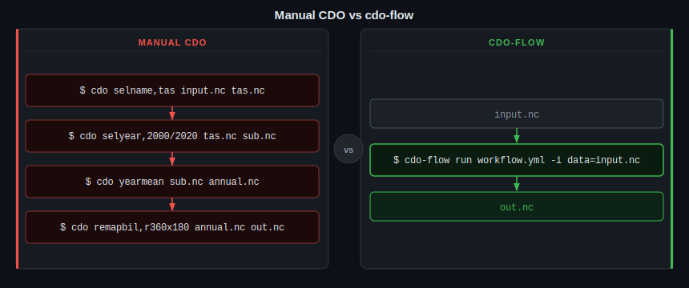

# cdo-flow

Workflow orchestration layer for CDO-based climate analysis, built on [python-cdo-wrapper](https://pypi.org/project/python-cdo-wrapper/).

Define multi-step processing pipelines in Python or YAML, run them in parallel with dependency tracking, inspect provenance, and explore results in an interactive TUI — all on top of CDO.

## Why cdo-flow?



**Without cdo-flow** - you write each CDO command by hand, pipe outputs into new files and run everything one step at a time:
- Every step must be typed and executed individually in the terminal
- Intermediate files (`tas.nc`, `sub.nc`, `annual.nc`) must be named and tracked by hand
- If a step fails, there is no record of what ran, you debug from bash history
- Sharing or re-running the pipeline means handing someone a list of commands

**With cdo-flow** - you describe the pipeline once and run it with a single command:
- All steps are declared in a `workflow.yml` (or as Python decorators) and version-controlled alongside your code
- Input files are passed at runtime; cdo-flow wires them through the pipeline automatically
- Independent steps run in parallel; a live progress display shows what is running and what finished
- Temp files are handled at each step; users can define whether to keep them or delete them in the workflows
- Every run produces a `provenance.json` capturing the exact commands, timing, exit codes and output paths

## Install

```bash
pip install cdo-flow
```

Requires [CDO](https://mpimet.mpg.de/cdo) to be installed and on `$PATH`.

## Quick start

### Python DSL

```python
from cdo_flow import Workflow, python_step, cdo_step
from python_cdo_wrapper.query import CDOQueryTemplate

@python_step
def write_data(ctx):
    ctx.output("result.txt").write_text("hello")

@cdo_step
def regrid(ctx, cdo):
    cdo.query(ctx.inputs["data"]).remap_bil("r360x180").to_file(ctx.output("regridded.nc"))

wf = Workflow(name="demo", run_dir="./runs")
wf.add_step("write", write_data)
wf.add_step(
    "regrid_tas",
    chain=CDOQueryTemplate().select_var("tas").year_mean(),
    inputs={"data": "/path/to/input.nc"},
    output=["tas_annual.nc"],
)
result = wf.run()
```

### YAML workflows

```yaml
name: my_workflow
steps:
  - id: select
    type: cdo
    inputs:
      data: /path/to/input.nc
    operator_chain:
      - op: selname
        args: [tas]
      - op: yearmean
    output: tas_annual.nc

  - id: postprocess
    type: python
    inputs:
      data: "@select.output"
    script: scripts/postprocess.py
    output: result.nc
```

```bash
cdo-flow run my_workflow.yml
```

## CLI reference

### `cdo-flow run`

Run a workflow from a YAML file.

```bash
# Basic
cdo-flow run workflow.yml

# Pass inputs positionally (mapped to declared input slots in order)
cdo-flow run workflow.yml model_a.nc model_b.nc

# Named inputs and parameters
cdo-flow run workflow.yml -i data=model.nc -p start_year=1980 -p end_year=2010

# Dry run — print execution plan without running
cdo-flow run workflow.yml --dry-run

# Disable TUI, use plain Rich table output (also auto-activated in non-TTY environments)
cdo-flow run workflow.yml --no-tui

# Custom run ID and parallel workers
cdo-flow run workflow.yml --run-id my_run --max-workers 4
```

### `cdo-flow validate`

Validate a workflow YAML — checks schema and DAG (cycles, missing refs).

```bash
cdo-flow validate workflow.yml
```

### `cdo-flow inspect`

Inspect a past run directory and display provenance.

```bash
cdo-flow inspect ./runs/my_workflow__20240115T102300Z/
```

Shows a summary panel and per-step table with durations, outputs, and CDO commands. Prints full stderr for any failed steps.

### `cdo-flow create`

Launch an interactive TUI wizard to build a new workflow and save it as YAML.

```bash
cdo-flow create                    # saves to workflow.yml
cdo-flow create -o pipelines/prep.yml
```

The wizard walks through workflow metadata, step-by-step definition (with a CDO operator picker), and writes a validated YAML file.

### `cdo-flow history`

Browse past runs in an interactive TUI.

```bash
cdo-flow history                   # scans ./runs/
cdo-flow history ./other/runs/     # custom runs directory
```

Select a run to view provenance, per-step durations, outputs, and CDO commands.

## Ensemble execution — `wf.map()`

Run the same workflow over a list of input sets in parallel.

```python
from cdo_flow import Workflow

wf = Workflow(name="bias_correction", run_dir="./runs")
# ... add steps ...

ensemble_inputs = [
    {"data": "model_a.nc"},
    {"data": "model_b.nc"},
    {"data": "model_c.nc"},
]

results = wf.map(ensemble_inputs, max_workers=3)
failed = [r for r in results if not r]
print(f"{len(results) - len(failed)}/{len(results)} members succeeded")
```

Each member runs in its own timestamped run directory. A Rich live progress display shows per-member step progress.

## Workflow parameters

Declare default parameter values in YAML, overridable at runtime with `-p`.

```yaml
name: baseline
params:
  start_year: 1990
  end_year: 2020
  variable: tas
steps:
  - id: extract
    type: python
    script: scripts/extract.py
```

```bash
cdo-flow run workflow.yml -p start_year=2000 -p end_year=2015
```

Inside a step: `ctx.params["start_year"]` → `"2000"`.

## Step context

Both `@python_step` and `@cdo_step` receive a `StepContext` object as `ctx`:

| Attribute | Description |
|-----------|-------------|
| `ctx.inputs["key"]` | Resolved `Path` for a named input |
| `ctx.output("file.nc")` | Returns a `Path` in the step's run directory |
| `ctx.params` | Dict of runtime parameters |
| `ctx.run_dir` | The step's working directory |
| `ctx.step_name` | Name of the current step |
| `ctx.workflow_name` | Name of the parent workflow |

## Provenance

Every run writes `provenance.json` to its run directory. It records:

- Workflow name, run ID, status, start/end timestamps
- Per-step state, duration, output paths, CDO command, exit code, stdout/stderr
- Versions of `cdo-flow`, `python-cdo-wrapper`, and the CDO executable

Use `cdo-flow inspect <run_dir>` or `cdo-flow history` to view it.

## Event hooks

Register a callback on `wf.run()` to receive `StepEvent` objects as steps execute:

```python
from cdo_flow.events import StepEvent

def on_event(event: StepEvent) -> None:
    print(event.type, event.step_name, event.duration_seconds)

wf.run(on_event=on_event, show_progress=False)
```

`StepEvent` fields: `type`, `step_name`, `state`, `timestamp`, `duration_seconds`, `outputs`, `error`, `command`.

## YAML schema reference

```yaml
name: string                  # required
description: string           # optional
run_dir: ./runs               # default: ./runs
keep_intermediates: true      # default: true
cdo_options:                  # passed to every CDO call
  threads: 4
output_path: /data/result.nc  # copy leaf output here after success
params:                       # default parameter values
  variable: tas
inputs:                       # declare named input slots (for positional CLI args)
  - data
  - reference
steps:
  - id: step_name             # required, unique
    type: cdo | python        # required
    inputs:                   # key: path or @other_step.output
      data: /path/to/file.nc
    operator_chain:           # cdo steps only
      - op: selname
        args: [tas]
    script: scripts/run.py    # python steps only
    output: result.nc         # output filename
    depends_on: [other_step]  # explicit deps (usually inferred from @refs)
    keep: true                # keep outputs after run
    resources:
      cpus: 2
      mem_gb: 8.0
      walltime: "01:00:00"
    tags: [tag1, tag2]
```

## Backends

| Backend | Status | Notes |
|---------|--------|-------|
| `local` | Available | `ProcessPoolExecutor`, parallel by default |
| `snakemake` | Planned (v0.3) | Generates a `Snakefile` |
| `dask/HPC` | Planned (v0.5) | via `dask-jobqueue` |

## Optional extras

```bash
pip install "cdo-flow[snakemake]"   # Snakemake backend (v0.3)
pip install "cdo-flow[hpc]"         # Dask/HPC backend (v0.5)
pip install "cdo-flow[shapefile]"   # geopandas/shapely for region masking
pip install "cdo-flow[dev]"         # pytest, ruff, mypy
```

## Requirements

- Python >= 3.10
- [CDO](https://mpimet.mpg.de/cdo) on `$PATH`
- `python-cdo-wrapper >= 1.1`

## Contributing

See [CONTRIBUTING.md](CONTRIBUTING.md).

## License

MIT
